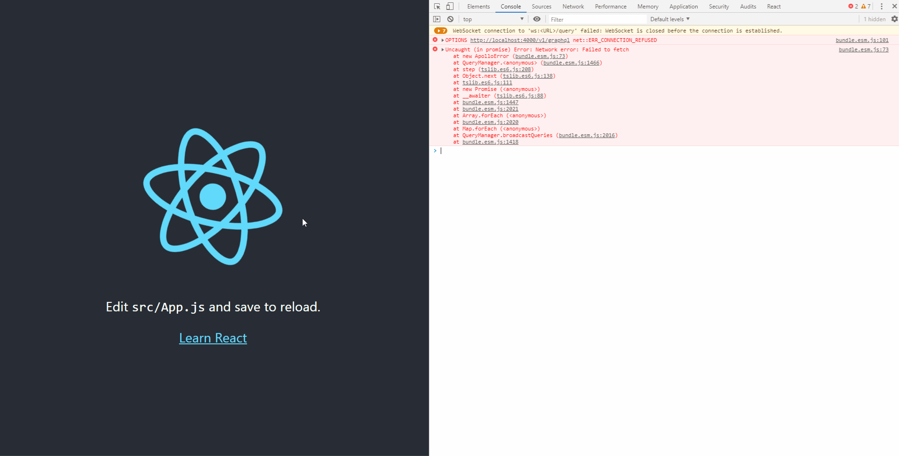

# Graphql-Multi-Url

As we know nowadays graphql is widely use for calling API. Graphql gives us logical endpoint to our API so as per wide era of application which possibly has two graphql endpoint so calling two endpoint from one application is some tricky part!

> This multi url demo gives you a demonstration to call multiple url as per requirement 

For installation clone or download the zip file and do this step.
```
npm install

npm start
```
nothing fancy here.

Now in the src folder their is `App.js` file where you can find the fetchQuery method which help us to retrive data from graphql.
In this method we use graphql client to fire the query inside the client.query you find something like this:
```
context: {
  version: 2
  }
```

This is the part where graphql know at which endpoint we have to fire the query.

Inside the `index.js` you find some code like:
```
const link = split(
  (operation) => operation.getContext().version === 1,
  new HttpLink({ uri: 'http://localhost:4000/v1/graphql' }),
  new HttpLink({ uri: "http://localhost:4000/v2/graphql" }),
  wsLink
);
```

Where `operation.getContext()` is like a switch using this we can switch between two graphql endpoints.
 - If version is equal to 1 then the condition is true and first endpoint will fire 
 - If version is not equal to 1 then condition is false and second endpoint is fire.

Now you can change the version in `App.js` file and run application again so as per condition in the `index.js` file the request will be fire to particular endpoint.

## Demo



In Browser's Console, you can see some errors displays. In this list of errors you can find second number error which tell us that connection is not establish to given endpoint.

By default, you can see `http://localhost:4000/v1/graphql` and when you change context version to 2, it will be changed to `http://localhost:4000/v2/graphql`.
